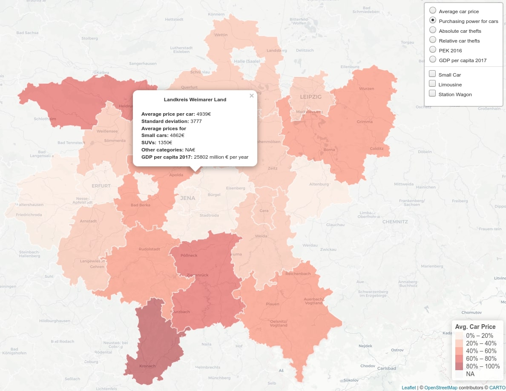

This group project and proof of concept was developed during the [Princeton Summer Institute for Computational Social Science in Bamberg 2019](https://compsocialscience.github.io/summer-institute/2019/bamberg/) in 4 days. The project aims to use web-craping techniques to retrieve data for used cars sold on ebay Kleinanzeigen (The German equivalent of [Craigslist](craigslist.org)) for selected regions and combine this data with indicators of income and potential economic inequality, as well as data on car theft in the examined regions. We hypothesized that these external factors significantly influence the median price of the vehicles for sale. First results can be found in our [group presentation](https://github.com/Studentenfutter/cars-inequality/blob/master/presentation/EBAY-Group_Presentation.pdf).

The projects code was completely done in R using collaborative coding and version control with [GitHub](https://github.com/Studentenfutter/cars-inequality/). The GitHub-Repository contains the scraper and the complete code for all steps of our analysis. In addition, my main focus in the project was the compilation of an interactive map as a potential tool for policy advisors and prospective car sellers/buyers: 

Due to file size limits the resulting interactive leaflet map cant be hosted on github but can be viewed by downloading and extracting [this zip file](https://drive.google.com/file/d/15fgAFabCP4UoCFuvmKpKP6tbWgPBlJFa/view?usp=sharing).

Unfortunately no further analyses was feasible during the 4 day project but may be conducted in the future.